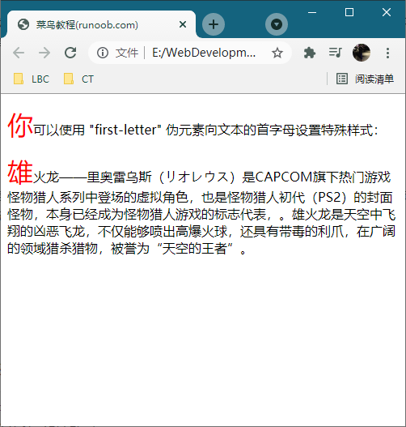
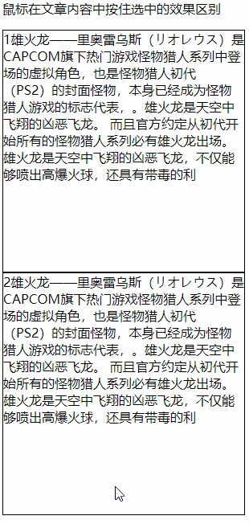

# 232 伪元素概念与意义

视频序号165

目录
- [232 伪元素概念与意义](#232-伪元素概念与意义)
- [1. 伪元素与伪类的区别](#1-伪元素与伪类的区别)
- [2. 总结](#2-总结)
  - [所有 CSS 伪类](#所有-css-伪类)
  - [所有 CSS 伪元素](#所有-css-伪元素)


***

# 1. 伪元素与伪类的区别

在CSS2.1中对伪类和伪元素的区别比较模糊。CSS3中对这两个概念做了相对较清晰地解释，并且在语法上也做了很明显的区分。
CSS3中规定伪类由一个冒号开始，然后为伪类的名称；伪元素由两个冒泡开始，然后为伪元素的名称。


伪类本质上是为了弥补常规CSS选择器的不足，以便获取到更多信息。通常表示获取不存在与DOM树中的信息，或获取不能被常规CSS选择器获取的信息。

 : hover
 : focus
 : empty
…


伪元素本质上是创建了一个有内容的虚拟容器。这个容器不包含任何DOM元素，但是可以包含内容。另外，开发者还可以为伪元素定制样式。

:: selection
:: first-line   /    first-letter
:: before     /     after 
…


**伪元素示例1：**

```
    <style>
        p:first-letter {
            color: #ff0000;
            font-size: xx-large;
        }
    </style>
</head>

<body>
    <p>你可以使用 "first-letter" 伪元素向文本的首字母设置特殊样式：</p>
    <p>雄火龙——里奥雷乌斯（リオレウス）是CAPCOM旗下热门游戏怪物猎人系列中登场的虚拟角色，也是怪物猎人初代（PS2）的封面怪物，本身已经成为怪物猎人游戏的标志代表，。雄火龙是天空中飞翔的凶恶飞龙，不仅能够喷出高爆火球，还具有带毒的利爪，在广阔的领域猎杀猎物，被誉为“天空的王者”。</p>
</body>
```



实例： [23201pseudo-elements01.html](23201pseudo-elements01.html) 

**伪元素示例2：**

```
        .box2::selection{
            background: black;
            color: gold;
        }
```



上面的是原始，下面的修改了文字被选中状态的背景色和字体色。

实例： [23201pseudo-elements02.html](23201pseudo-elements02.html) 


# 2. 总结

## 所有 CSS 伪类

| 选择器                                                       | 例子                  | 例子描述                                                     |
| :----------------------------------------------------------- | :-------------------- | :----------------------------------------------------------- |
| [:active](https://www.w3school.com.cn/cssref/selector_active.asp) | a:active              | 选择活动的链接。                                             |
| [:checked](https://www.w3school.com.cn/cssref/selector_checked.asp) | input:checked         | 选择每个被选中的 <input> 元素。                              |
| [:disabled](https://www.w3school.com.cn/cssref/selector_disabled.asp) | input:disabled        | 选择每个被禁用的 <input> 元素。                              |
| [:empty](https://www.w3school.com.cn/cssref/selector_empty.asp) | p:empty               | 选择没有子元素的每个 <p> 元素。                              |
| [:enabled](https://www.w3school.com.cn/cssref/selector_enabled.asp) | input:enabled         | 选择每个已启用的 <input> 元素。                              |
| [:first-child](https://www.w3school.com.cn/cssref/selector_first-child.asp) | p:first-child         | 选择作为其父的首个子元素的每个 <p> 元素。                    |
| [:first-of-type](https://www.w3school.com.cn/cssref/selector_first-of-type.asp) | p:first-of-type       | 选择作为其父的首个 <p> 元素的每个 <p> 元素。                 |
| [:focus](https://www.w3school.com.cn/cssref/selector_focus.asp) | input:focus           | 选择获得焦点的 <input> 元素。                                |
| [:hover](https://www.w3school.com.cn/cssref/selector_hover.asp) | a:hover               | 选择鼠标悬停其上的链接。                                     |
| [:in-range](https://www.w3school.com.cn/cssref/selector_in-range.asp) | input:in-range        | 选择具有指定范围内的值的 <input> 元素。                      |
| [:invalid](https://www.w3school.com.cn/cssref/selector_invalid.asp) | input:invalid         | 选择所有具有无效值的 <input> 元素。                          |
| [:lang(*language*)](https://www.w3school.com.cn/cssref/selector_lang.asp) | p:lang(it)            | 选择每个 lang 属性值以 "it" 开头的 <p> 元素。                |
| [:last-child](https://www.w3school.com.cn/cssref/selector_last-child.asp) | p:last-child          | 选择作为其父的最后一个子元素的每个 <p> 元素。                |
| [:last-of-type](https://www.w3school.com.cn/cssref/selector_last-of-type.asp) | p:last-of-type        | 选择作为其父的最后一个 <p> 元素的每个 <p> 元素。             |
| [:link](https://www.w3school.com.cn/cssref/selector_link.asp) | a:link                | 选择所有未被访问的链接。                                     |
| [:not(*selector*)](https://www.w3school.com.cn/cssref/selector_not.asp) | :not(p)               | 选择每个非 <p> 元素的元素。                                  |
| [:nth-child(*n*)](https://www.w3school.com.cn/cssref/selector_nth-child.asp) | p:nth-child(2)        | 选择作为其父的第二个子元素的每个 <p> 元素。                  |
| [:nth-last-child(*n*)](https://www.w3school.com.cn/cssref/selector_nth-last-child.asp) | p:nth-last-child(2)   | 选择作为父的第二个子元素的每个<p>元素，从最后一个子元素计数。 |
| [:nth-last-of-type(*n*)](https://www.w3school.com.cn/cssref/selector_nth-last-of-type.asp) | p:nth-last-of-type(2) | 选择作为父的第二个<p>元素的每个<p>元素，从最后一个子元素计数 |
| [:nth-of-type(*n*)](https://www.w3school.com.cn/cssref/selector_nth-of-type.asp) | p:nth-of-type(2)      | 选择作为其父的第二个 <p> 元素的每个 <p> 元素。               |
| [:only-of-type](https://www.w3school.com.cn/cssref/selector_only-of-type.asp) | p:only-of-type        | 选择作为其父的唯一 <p> 元素的每个 <p> 元素。                 |
| [:only-child](https://www.w3school.com.cn/cssref/selector_only-child.asp) | p:only-child          | 选择作为其父的唯一子元素的 <p> 元素。                        |
| [:optional](https://www.w3school.com.cn/cssref/selector_optional.asp) | input:optional        | 选择不带 "required" 属性的 <input> 元素。                    |
| [:out-of-range](https://www.w3school.com.cn/cssref/selector_out-of-range.asp) | input:out-of-range    | 选择值在指定范围之外的 <input> 元素。                        |
| [:read-only](https://www.w3school.com.cn/cssref/selector_read-only.asp) | input:read-only       | 选择指定了 "readonly" 属性的 <input> 元素。                  |
| [:read-write](https://www.w3school.com.cn/cssref/selector_read-write.asp) | input:read-write      | 选择不带 "readonly" 属性的 <input> 元素。                    |
| [:required](https://www.w3school.com.cn/cssref/selector_required.asp) | input:required        | 选择指定了 "required" 属性的 <input> 元素。                  |
| [:root](https://www.w3school.com.cn/cssref/selector_root.asp) | root                  | 选择元素的根元素。                                           |
| [:target](https://www.w3school.com.cn/cssref/selector_target.asp) | #news:target          | 选择当前活动的 #news 元素（单击包含该锚名称的 URL）。        |
| [:valid](https://www.w3school.com.cn/cssref/selector_valid.asp) | input:valid           | 选择所有具有有效值的 <input> 元素。                          |
| [:visited](https://www.w3school.com.cn/cssref/selector_visited.asp) | a:visited             | 选择所有已访问的链接。                                       |

## 所有 CSS 伪元素

| 选择器                                                       | 例子            | 例子描述                      |
| :----------------------------------------------------------- | :-------------- | :---------------------------- |
| [::after](https://www.w3school.com.cn/cssref/selector_after.asp) | p::after        | 在每个 <p> 元素之后插入内容。 |
| [::before](https://www.w3school.com.cn/cssref/selector_before.asp) | p::before       | 在每个 <p> 元素之前插入内容。 |
| [::first-letter](https://www.w3school.com.cn/cssref/selector_first-letter.asp) | p::first-letter | 选择每个 <p> 元素的首字母。   |
| [::first-line](https://www.w3school.com.cn/cssref/selector_first-line.asp) | p::first-line   | 选择每个 <p> 元素的首行。     |
| [::selection](https://www.w3school.com.cn/cssref/selector_selection.asp) | p::selection    | 选择用户选择的元素部分。      |
