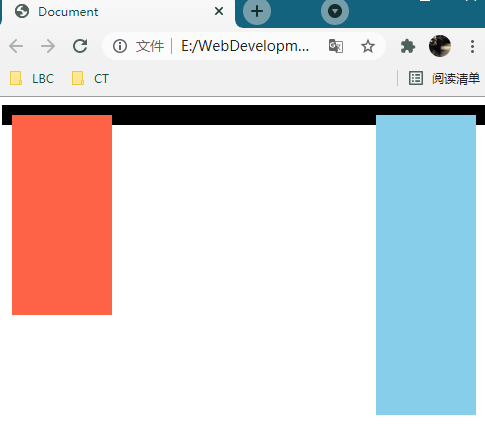
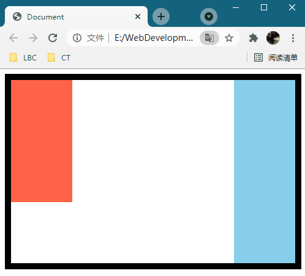
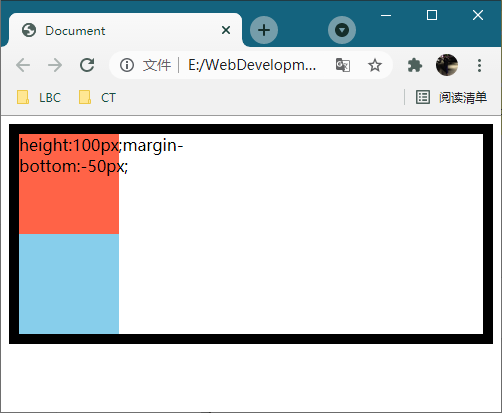
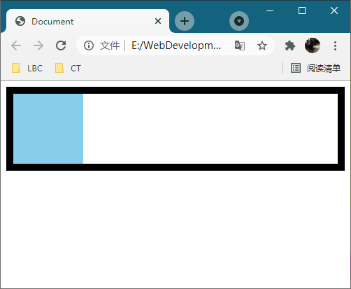
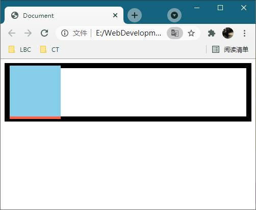
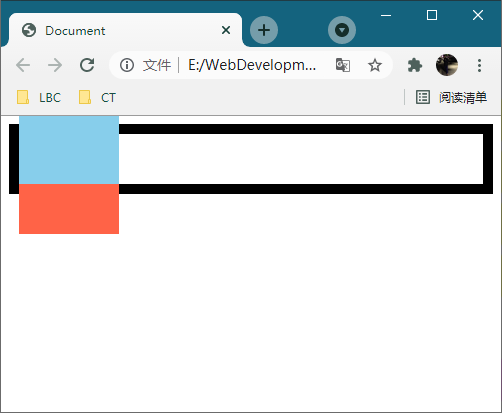
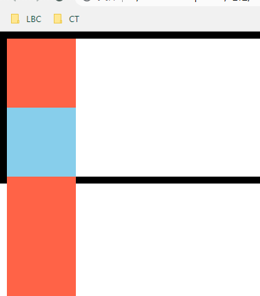
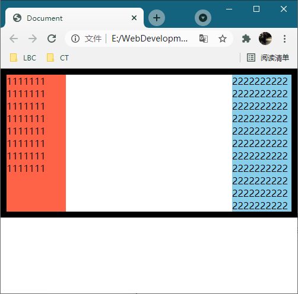
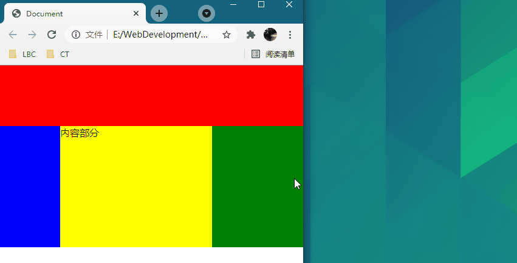

# 234 布局扩展

视频序号170-172

目录
- [234 布局扩展](#234-布局扩展)
- [1. 等高布局](#1-等高布局)
- [2.双飞翼布局](#2双飞翼布局)
- [3. 圣杯布局](#3-圣杯布局)


***

# 1. 等高布局

利用margin-bottom负值与padding-bottom配合实现。

**1.有 float 浮动并用 overflow:hidden 解决高度塌陷问题：**

```
        #parent{
            border: 10px solid black;
            overflow: hidden;
            /* 取消 overflow: hidden 试效果 */
        }
        #box1{
            width: 100px;
            height: 200px;
            float: left;
            background: tomato;
        }
        #box2{
            width: 100px;
            height: 300px;
            float: right;
            background: skyblue;
        }
    </style>
</head>
<body>
    <div id="parent">
        <div id="box1"></div>
        <div id="box2"></div>
    </div>
```

没有 overflow: hidden; 时：



添加 overflow: hidden; 后：



实例： [23401layout01.html](23401layout01.html) 


**2.无浮动情况下，把第一个块设margin-bottom为负值，无设高度的父元素会纵向缩小。**

```
        #parent{
            border: 10px solid black;
        }
        #box1{
            width: 100px;
            height: 100px;
            background: tomato;
            /* margin-bottom: -50px; */
            /* margin-bottom: -00px; */
            /* margin-bottom: -100px; */
            /* margin-bottom: -105px; */
            /* margin-bottom: -200px; */
            /* 如果负值很大很大，父元素会塌陷 */
        }
        #box2{
            width: 100px;
            height: 100px;
            background: skyblue;
        }
    </style>
</head>
<body>
    <div id="parent">
        <div id="box1">
            height:100px;margin-bottom:-50px;</div>

        <div id="box2"></div>
    </div>
</body>
```

margin-bottom: -50px; 时



margin-bottom: -100px; 时



margin-bottom: -105px; 时



margin-bottom: -150px; 时



实例： [23401layout02.html](23401layout02.html) 


**3.根据上面的代码不变，添加padding-bottom属性**

```
        #box1{
            width: 100px;
            height: 100px;
            background: tomato;
            margin-bottom: -2000px;
            /* 如果负值很大很大，父元素会塌陷 */
            padding-bottom: 2000px;
        }
```



下面红块到底了。

实例： [23401layout03.html](23401layout03.html) 


**4.父元素添加overflow:hidden，子元素设floa并输入内容，所以父元素高度按内容决定**

```
    <style>
        *{margin: 0;padding: 0;}
        #parent{
            border: 10px solid black;
            overflow: hidden;
        }
        #box1{
            width: 100px;
            background: tomato;
            float: left;
            margin-bottom: -2000px;
            /* 如果负值很大很大，父元素会塌陷 */
            padding-bottom: 2000px;
        }
        #box2{
            width: 100px;
            float: right;
            background: skyblue;
            margin-bottom: -2000px;
            padding-bottom: 2000px;
        }
    </style>
</head>
<body>
    <div id="parent">
        <div id="box1">
            <p>1111111</p>
            <p>1111111</p>
            <p>1111111</p>
            <p>1111111</p>
            <p>1111111</p>
            <p>1111111</p>
            <p>1111111</p>
            <p>1111111</p>
        </div>

        <div id="box2">
            <p>2222222222</p>
            <p>2222222222</p>
            <p>2222222222</p>
            <p>2222222222</p>
            <p>2222222222</p>
            <p>2222222222</p>
            <p>2222222222</p>
            <p>2222222222</p>
            <p>2222222222</p>
            <p>2222222222</p>
            <p>2222222222</p>
        </div>
    </div>
</body>
```



 [23401layout04.html](23401layout04.html) 


# 2.双飞翼布局

**1.三列布局，左右固定，中间自适应**

```
    <style>
        * {
            margin: 0;
            padding: 0;
        }
        .header {
            height: 100px;
            background: red;
        }
        .container .center {
            height: 200px;
            float: left;
            width: 100%;
        }
        .container .center p {
            background: yellow;
            height: 100%;
            margin: 0 150px 0 100px;
        }
        .container .left {
            float: left;
            width: 100px;
            height: 200px;
            background: blue;
            margin-left: -100%;
        }
        .container .right {
            float: left;
            width: 150px;
            height: 200px;
            background: green;
            margin-left: -150px;
        }
    </style>
    
<body>
    <div class="header"></div>
    <div class="container">
        <div class="center">
            <p>内容部分</p>
        </div>
        <div class="left"></div>
        <div class="right"></div>
    </div>
</body>
```



左100px 中自适应 右150px

实例： [23402layout01.html](23402layout01.html) 


**2.优化上面的代码**

```
    <style>
        *{margin: 0;padding: 0;}
        .header{
            width: 100%;
            height: 100px;
            background: royalblue;
        }
        .container{
            width: 100%;
        }
        .container .center{
            width: 100%;
            height: 200px;
            float: left;
            background: lightskyblue;
        }
        .container .center p{
            margin: 0 150px 0 100px;
            height: 100%;
            background: lightseagreen;
        }

        .container .left{
            width: 100px;
            height: 200px;
            float: left;
            background: tomato;
            margin-left: -100%;
            /* 取消上面一行试效果 */
        }
        .container .right{
            width: 150px;
            height: 200px;
            float: left;
            background: brown;
            margin-left: -150px;
            /* 取消上面一行试效果 */
        }
    </style>
</head>
<body>
    <div class="header"></div>
    <div class="container">
        <div class="center">
            <p>内容部分</p>
        </div>
        <div class="left"></div>
        <div class="right"></div>
    </div>
</body>
```

center:  width:100% ,float:left

left:  width:100px, float:left ,margin-left:100%，因为100%才能移到左侧

right:  width:150px, float:left,  margin-left:-150px，因为-150px就是向左位移150px从而自动往上一行

center的内容问题用margin:0px 150px 0px 100px解决

 [23402layout02.html](23402layout02.html) 


**3.上面的代码挺麻烦，采用calc方法更优化**

```
    <style>
        *{margin: 0;padding: 0;}
        .header{
            width: 100%;
            height: 100px;
            background: tomato;
        }
        .container{
            width: 100%;
        }
        .container .left{
            width: 100px;
            height: 200px;
            background: turquoise;
            float: left;
        }
        .container .center{
            width: calc(100% - 100px - 150px);
            height: 200px;
            background: seagreen;
            float: left;
        }
        .container .right{
            width: 150px;
            height: 200px;
            background: lightseagreen;
            float: left;
        }
    </style>
</head>
<body>
    <div class="header"></div>
    <div class="container">
        <div class="left"></div>
        <div class="center">内容内容</div>
        <div class="right"></div>
    </div>
</body>
```

块元素顺序为left center right且都设高度和float:left

left固定宽度100px

center用calc方法即width:calc(100% - 100px - 150px)

right固定宽度150px

实例： [23402layout03.html](23402layout03.html) 


# 3. 圣杯布局

```
    <style>
        *{margin: 0;padding: 0;}
        .clear:after{
            content: "";
            display: block;
            clear: both;
        }
        .header{
            width: 100%;
            height: 100px;
            background: goldenrod;
        }
        .container{
            background: tomato;
            margin: 0 150px 0 100px;
        }
        .container .center{
            width: 100%;
            height: 200px;
            float: left;
        }
        .container .left{
            width: 100px;
            height: 200px;
            background: gold;
            float: left;
            position: relative;
            margin-left: -100%;
            left: -100px;
        }
        .container .right{
            width: 150px;
            height: 200px;
            background: yellow;
            float: left;
            position: relative;
            margin-left: -150px;
            right: -150px;
        }
    </style>
</head>
<body>
    <div class="header"></div>
    <div class="container  clear">
        <div class="center">内容</div>
        <div class="left">123</div>
        <div class="right">456</div>
    </div>
</body>
```

块元素顺序：center, left, right。

3个左中右子元素的父元素设 background 颜色，margin 0 150px 0 100px并需要after伪类清浮动。

左中右子元素均设高度200px。

实例： [23403layout01.html](23403layout01.html) 
