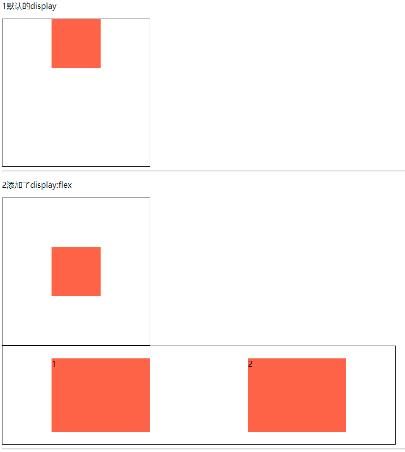

# 301 flex弹性盒布局

视频序号184-188


***

随着移动互联网的发展，对于网页布局来说要求越来越高，而传统的布局方案对于实现特殊布局非常不方便，依赖 **display属性** + **position属性** + **float属性**。比如垂直居中不容易实现。
2009年，W3C 提出了一种新的方案----Flex 布局，可以简便、完整、响应式地实现各种页面布局。目前，它已经得到了所有浏览器的支持，这意味着，现在就能很安全地使用这项功能。

Flex 是 Flexible Box 的缩写，意为"弹性布局"，用来为盒状模型提供最大的灵活性。

| 作用在flex容器上 | **作用在flex子项上** |
| ---------------- | -------------------- |
| flex-direction   | order                |
| flex-wrap        | flex-grow            |
| flex-flow        | flex-shrink          |
| justify-content  | flex-basis           |
| align-items      | flex                 |
| align-content    | align-self           |

任何一个容器都可以指定为 Flex 布局。

```
.box{
  display: flex;
}
```

行内元素也可以使用 Flex 布局。

```
.box{
  display: inline-flex;
}
```


Webkit 内核的浏览器，必须加上 -webkit 前缀。

```
.box{
  display: -webkit-flex; /* Safari */
  display: flex;
}
```


**==注意==**

* 设为 Flex 布局以后，子元素的 float、clear 和 vertical-align 属性将失效。

简单示例：

```
    <style>
        .parent1{
            width: 300px;
            height: 300px;
            border: 1px solid black;
        }
        .box{
            width: 100px;
            height: 100px;
            background: tomato;
            margin: auto;
        }

        .parent2{
            width: 300px;
            height: 300px;
            border: 1px solid black;
            display: flex;
        }
        .box2{
            width: 100px;
            height: 100px;
            background: tomato;
            margin: auto;
        }
        .parent3{
            width: 800px;
            height: 200px;
            border: 1px solid black;
            display: flex;
        }
        .box3{
            width: 200px;
            height: 150px;
            background: tomato;
            margin: auto;
        }
    </style>
```



实例： [3010001.html](3010001.html) 


# 1. flex-direction

决定主轴的方向（即项目的排列方向）。
